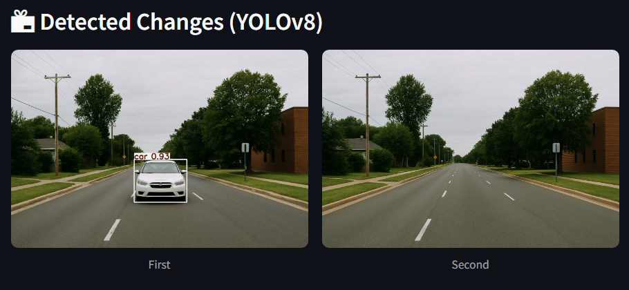
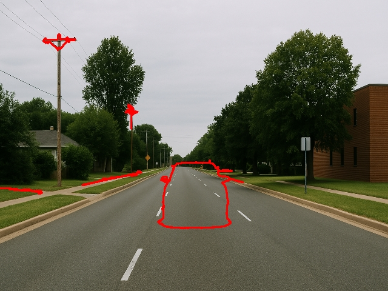
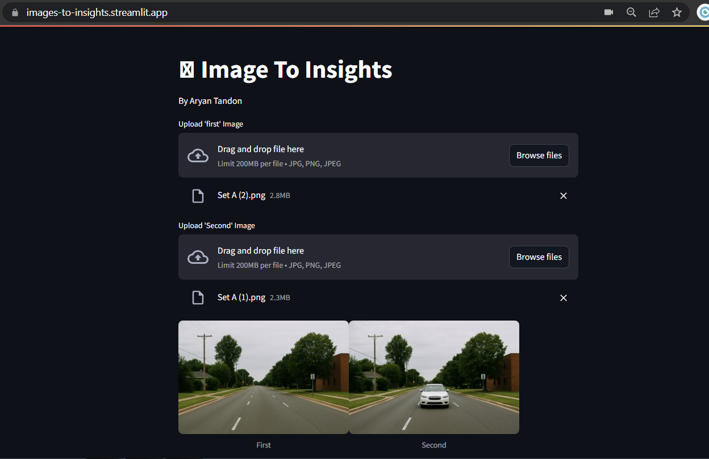

# 🖼️ Images to Insights

## Overview

[Images to Insights](https://images-to-insights.streamlit.app/) is a powerful visual intelligence tool that detects and summarizes **changes between two images** using a hybrid approach combining:

- **YOLOv8 (object-level difference detection)**
- **OpenCV (pixel-level difference detection)**

## Features

- ✅ **YOLOv8-Based Object Comparison**
  - Detects object-level differences (e.g., cars, people, etc.)
  - Identifies added, removed, or moved entities

- 🔍 **Pixel-Level Comparison with OpenCV**
  - Computes and visualizes raw pixel differences
  - Highlights subtle changes missed by object detectors

- 🧾 **Natural Language Summary**
  - Generates human-readable summaries of what changed
  - Supports both object and pixel difference explanations

- 💻 **Streamlit UI**
  - Simple web interface to upload and compare images
  - View both bounding boxes and pixel diffs side-by-side

Packages used for this project:

- `ultralytics` for YOLOv8 model(object level detection)
- `opencv-python`(for image processing and pixel level detection
- `numpy` for converting images to arrays
- `streamlit` for interface
- `Pillow` for image handling, format conversion
## Example Outputs

Below are sample visual outputs generated by the system:

- **YOLO-based Entity Detection**
  
  

- **OpenCV-based Pixel Difference**

  

---

## User Interface

The following screenshot shows the web interface built using Streamlit:



### Installation

1. Clone the repository:
   ```bash
   git clone https://github.com/PhoenixAlpha23/image-to-insights.git
   cd image-to-insights
2. Install required dependencies:
   ```bash
   pip install -r requirements.txt
3. Run the application:
   ```bash
   streamlit run app.py
  
